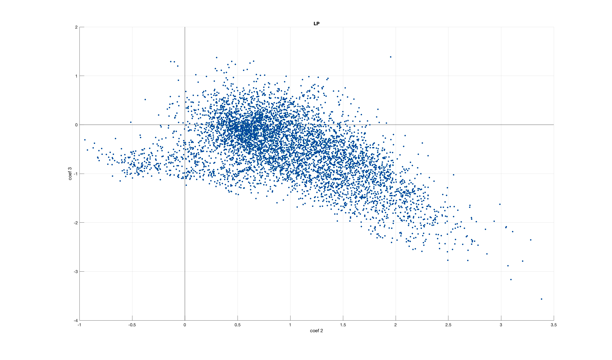
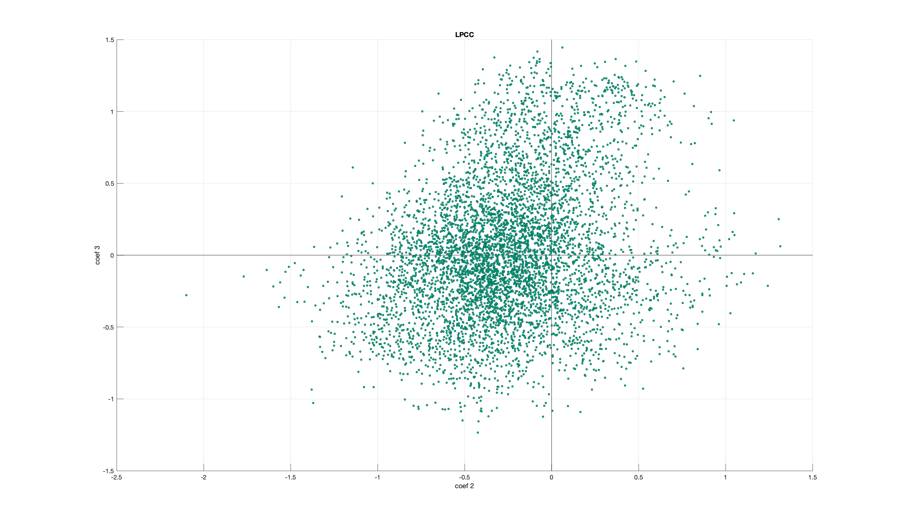
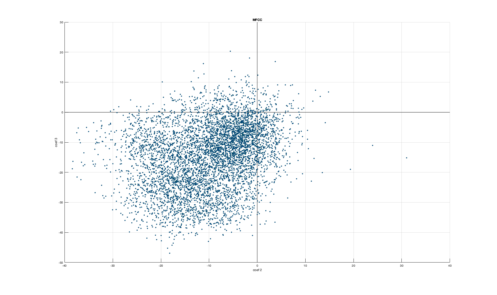
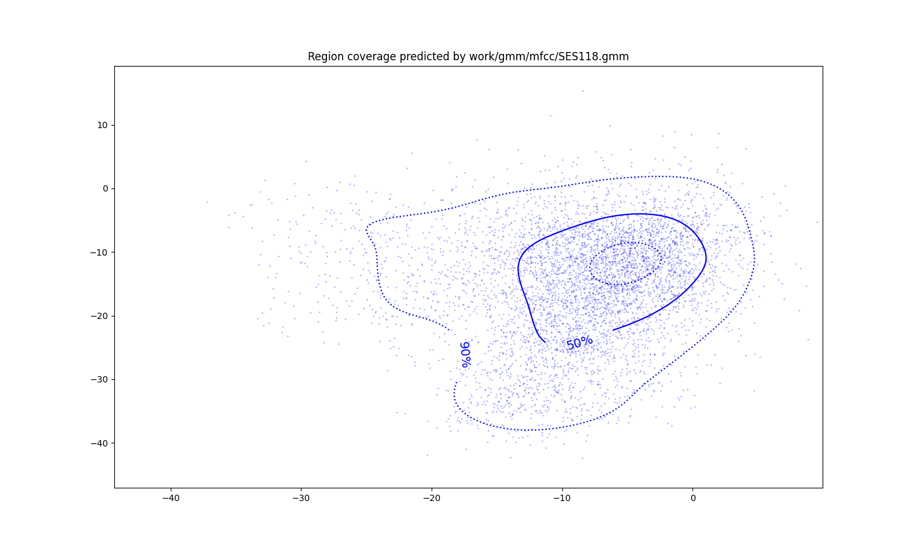
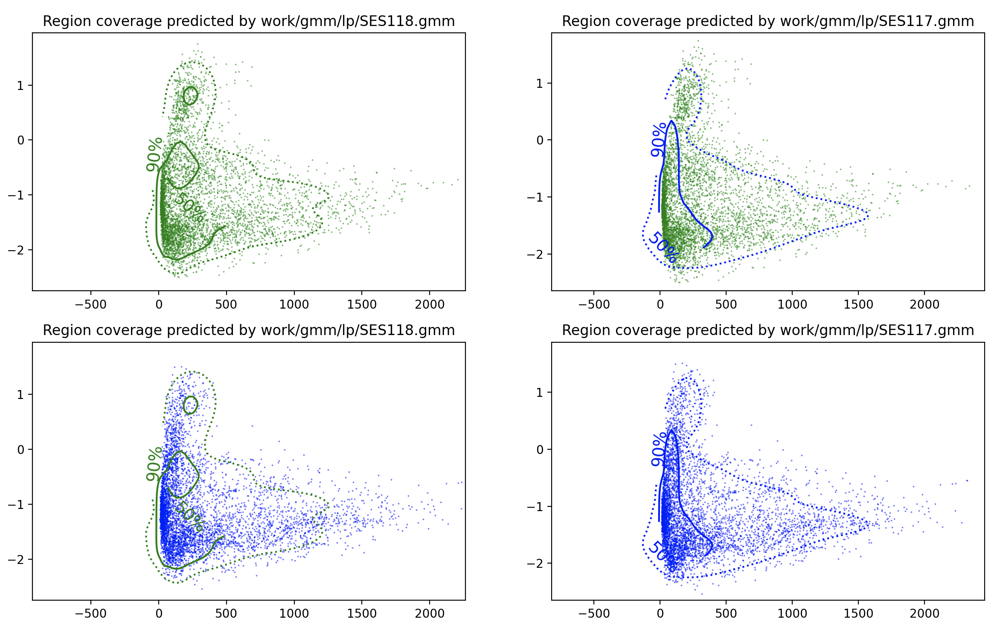

PAV - P4: reconocimiento y verificación del locutor
===================================================

Obtenga su copia del repositorio de la práctica accediendo a [Práctica 4](https://github.com/albino-pav/P4)
y pulsando sobre el botón `Fork` situado en la esquina superior derecha. A continuación, siga las
instrucciones de la [Práctica 2](https://github.com/albino-pav/P2) para crear una rama con el apellido de
los integrantes del grupo de prácticas, dar de alta al resto de integrantes como colaboradores del proyecto
y crear la copias locales del repositorio.

También debe descomprimir, en el directorio `PAV/P4`, el fichero [db_8mu.tgz](https://atenea.upc.edu/mod/resource/view.php?id=3654387?forcedownload=1)
con la base de datos oral que se utilizará en la parte experimental de la práctica.

Como entrega deberá realizar un *pull request* con el contenido de su copia del repositorio. Recuerde
que los ficheros entregados deberán estar en condiciones de ser ejecutados con sólo ejecutar:

~~~~~~~~~~~~~~~~~~~~~~~~~~~~~~~~~~~~~~~~~~~~~~~~~~~~~.sh
  make release
  run_spkid mfcc train test classerr verify verifyerr
~~~~~~~~~~~~~~~~~~~~~~~~~~~~~~~~~~~~~~~~~~~~~~~~~~~~~

Recuerde que, además de los trabajos indicados en esta parte básica, también deberá realizar un proyecto
de ampliación, del cual deberá subir una memoria explicativa a Atenea y los ficheros correspondientes al
repositorio de la práctica.

A modo de memoria de la parte básica, complete, en este mismo documento y usando el formato *markdown*, los
ejercicios indicados.

## Ejercicios.

### SPTK, Sox y los scripts de extracción de características.

- Analice el script `wav2lp.sh` y explique la misión de los distintos comandos involucrados en el *pipeline*
  principal (`sox`, `$X2X`, `$FRAME`, `$WINDOW` y `$LPC`). Explique el significado de cada una de las opciones empleadas y de sus valores.

    >L'script implementa un extractor de característiques de veu  simple utilitzant eines del paquet de senyal de processament de SPTK. La funció de l'extractor de característiques és prendre un fitxer d'àudio en format WAV i extreure'n els coeficients de predicció lineal (LPC) utilitzant la funció LPC de SPTK.
    - Missió dels "comandos" involucrats a:

          sox $inputfile -t raw -e signed -b 16 - | $X2X +sf | $FRAME -l 240 -p 80 | $WINDOW -l 240 -L 240 |$LPC -l 240 -m $lpc_order > $base.lp || exit 1
    
        >`sox`: convertir el fitxer d'àudio d'entrada en format WAV en >una seqüència de mostres d'àudio sense processar en format de >dades PCM de 16 bits amb signe. Tres paràmetres:
        > - -t: tipus de fitxer.
        > - -e: tipus de codificació.
        > - -b: bits de la mostra codificada.

       >`$XSX`: conversió de dades a la línia d'ordres utilitzada per >convertir diferents tipus de dades binàries, com enters de 16 >o 32 bits, números de coma flotant de precisió simple o doble, >etc. En aquest script, s'utilitza per convertir la seqüència >de mostres d'àudio sense processar de format PCM de 16 bits >generada per l'ordre sox en una seqüència de números de coma >flotant de precisió simple, que és el format d'entrada >requerit pel següent comanda a la pipeline.
      > - +sf: (short 2byte), f (float 4byte).

      >`$FRAME`: s'utilitza per dividir una seqüència de dades en >marcs (frames) solapats i aplicar una finestra (window) a cada >marc. Aquest codi s'utilitza per dividir la seqüència de >mostres d'àudio d'entrada en marcs de 240 mostres amb un pas >(hop size) de 80 mostres entre ells. Que es corresponen a 30ms i >10 ms si tenim en compte que la fm és 8 kHz.
      >- l: frame length.
      >- p: frame period.

      >`$WINDOW`: aplica una finestra a cada marc de dades en una >seqüència de marcs. La finestra s'utilitza per suavitzar les >transicions entre els marcs i reduir els efectes de les >discontinuïtat de les vores dels marcs. S'aplica una finestra >de Blackman (per defecte) de longitud 240 mostres a cada marc >de dades.
      >  - -l: frame length of input.
      >  - -L: frame length of output.

      >`$LPC`: s'utilitza per estimar els coeficients del model LPC >>(Linear Predictive Coding) a cada marc de dades. El model LPC >s'utilitza per modelar l'espectre d'un segment de senyal de veu >i per representar de manera compacta els segments de senyal de >veu. En aquest pipeline, s'utilitza per estimar els coeficients >LPC d'ordre lpc_order a cada marc de dades.
      > - -l: frame length of input.
       >- -m: LPC order.

      >Al final, la sortida del conjunt d'ordres al pipeline s'envia al >fitxer temporal $base.lp. Aquest fitxer temporal rep el mateix nom >que l'script, seguit d'un identificador únic de procés, >aconseguint que cada execució tingui el seu propi fitxer temporal >únic.

- Explique el procedimiento seguido para obtener un fichero de formato *fmatrix* a partir de los ficheros de
  salida de SPTK (líneas 45 a 51 del script `wav2lp.sh`).

  ```# Main command for feature extration
  sox $inputfile -t raw -e signed -b 16 - | $X2X +sf | $FRAME -l 240 -p 80 | $WINDOW -l 240 -L 240 |
    $LPC -l 240 -m $lpc_order > $base.lp || exit 1
  # Our array files need a header with the number of cols and rows:
  ncol=$((lpc_order+1)) # lpc p =>  (gain a1 a2 ... ap) 
  nrow=`$X2X +fa < $base.lp | wc -l | perl -ne 'print $_/'$ncol', "\n";'`
  ```
  >Com veiem primer s'executen les liníes que hem explicat anteriorment. 
  Seguidament es defineix la variable ncol com el valor de lpc_order més un. La teoria ens indica que primer coeficient de la sortida del filtre LPC representa el guany global del senyal, mentre que els coeficients restants representen les característiques del senyal. Per tant, el nombre de columnes de la matriu de característiques és igual al nombre de coeficients LPC més un.

  >La següent línia extreu el número de files segons el fitxer (depèn de la longitud del senyal, la longitud i el desplaçament de la finestra i totes les ordres del pipeline que s'executen per obtenir la parametrització). Detalladament: s'utilitza l'ordre $X2X per convertir el fitxer temporal $base.lp en un fitxer binari de punt flotant. L'ordre wc -l compta amb el nombre de línies del fitxer d'entrada. Després, s'utilitza la comanda perl per dividir aquest nombre de línies pel nombre de columnes ($ncol) i arrodonir el resultat a l'enter més proper. El resultat final s'emmagatzema a la variable nrow, que representa el nombre de files de la matriu de característiques.

  * ¿Por qué es más conveniente el formato *fmatrix* que el SPTK?

    >El format fmatrix és més convenient que el format SPTK en aquest context perquè permet emmagatzemar i accedir a les dades de manera més eficient i senzilla. En utilitzar el format fmatrix, el senyal d'entrada es converteix en una matriu amb una estructura ben definida, cosa que en facilita la manipulació. A més, la informació sobre el nombre de trames i coeficients es troba implicitament amb la matriu, cosa que fa que sigui més fàcil obtenir aquesta informació sense haver d'analitzar tot l'arxiu. 


- Escriba el *pipeline* principal usado para calcular los coeficientes cepstrales de predicción lineal
  (LPCC) en su fichero <code>scripts/wav2lpcc.sh</code>:

  <code>sox $inputfile -t raw -e signed -b 16 - | $X2X +sf | $FRAME -l 240 -p 80 | $WINDOW -l 240 -L 240 |
   $LPC -l 240 -m $lpc_order | $LPCC -m $lpc_order -M $cepstrum_order > $base.lpcc
   </code>

- Escriba el *pipeline* principal usado para calcular los coeficientes cepstrales en escala Mel (MFCC) en su
  fichero <code>scripts/wav2mfcc.sh</code>:

  <code>
  sox $inputfile -t raw -e signed -b 16 - | $X2X +sf | $FRAME -l 240 -p 80 | $WINDOW -l 240 -L 240 |
   $MFCC -l 240 -m $mfcc_order -n $filter_bank_order -s $freq > $base.mfcc
   </code>

### Extracción de características.

- Inserte una imagen mostrando la dependencia entre los coeficientes 2 y 3 de las tres parametrizaciones
  para todas las señales de un locutor.
  
  
  

  
  
  + Indique **todas** las órdenes necesarias para obtener las gráficas a partir de las señales 
    parametrizadas.


    >Per tal de representar les gràfiques primer de tot hem hagut de crear el codi de les funcions compute_lpcc i compute_mfcc.
    Llavors hem modificat el *meson.build* de la carpeta scripts per tal de que ens crees l'objecte en la carpeta bin. Seguidament li hem donat permís d'execució a l'script. Al finalitzar repetides proves executant només l'ordre compute_$FEAT .... (on ... represeten els seus paràmetres corresponents) i asssegurant-nos del seu correcte funcionament. Executem:

     ```bash 
     FEAT=lpcc run_spkid lpcc

     FEAT=mfcc run_spkid mfcc
     ```
    >Seguidament hem copiat els coeficients 2 i 3 d'una sessió qualsevol com a columnes d'un fitxer guardat en una carpeta creada prèviament.
    ```bash 
    mkdir img

    fmatrix_show work/lp/BLOCK27/SES277/*.lp | egrep '^\[' | cut -f4,5 > img/graf_lp.txt

    fmatrix_show work/lpcc/BLOCK27/SES277/*.lpcc | egrep '^\[' | cut -f4,5 > img/graf_lpcc.txt

    fmatrix_show work/mfcc/BLOCK27/SES277/*.mfcc | egrep '^\[' | cut -f4,5 > img/graf_mfcc.txt
    ```
   
    >Finalment s'ha utilitzat *Matlab* per representar una gràfica de punts que ens mostra la relació entre els dos coeficients. Es mostra el codi per a la representació de la relació dels coeficients LP (els codis restants es troben a la carpeta /img).

    ```bash 
    data = load('graf_lp.txt');
    x = data(:,1);
    y = data(:,2);

    sz = 10;
    scatter(x, y, sz, 'MarkerEdgeColor',[0 .5 .5],...
              'MarkerFaceColor',[0 .1 .7],...
              'LineWidth',0.5);
    grid on
    xlabel('coef 2')
    ylabel('coef 3')
    title('LP')
    hold on

    hlines=line([0 0], ylim, 'Color', 'k', 'LineWidth', 0.5); 
    vlines=line(xlim, [0 0], 'Color', 'k', 'LineWidth', 0.5); 
    hold off

    uistack(hlines, 'bottom');
    uistack(vlines, 'bottom');
    ```


  + ¿Cuál de ellas le parece que contiene más información?

    > Si observem les tres gràfiques una al costat de l'altre podem apreciar que la que representa els coeficients LP té una lleugera forma de recta. Aquest fet és significatiu, ja que ens indica que els coficients 2 i 3 son similars. Una similitud entre dos coeficient contigus ens aportarà menys informació sobre el locutor, és a dir, si el gràfic està més dispers tenim una major entropia que significa major informació. Els gràfics més dispersos són els LPCC i MFCC, no és fàcil decidir quin té més dispersió, possiblement la 'Representació LPCC'. 

    >Si observem les tres gràfiques una al costat de l'altre podem apreciar que la que representa els coeficients LP té una lleugera forma de recta. Aquest fet és significatiu, ja que ens indica que els coficients 2 i 3 son similars. Una similitud entre dos coeficient contigus ens aportarà menys informació sobre el locutor, és a dir, si el gràfic està més dispers tenim una major entropia que significa major informació. Els gràfics més dispersos són els LPCC i MFCC, no és fàcil decidir quin té més dispersió, possiblement la 'Representació LPCC'. 


- Usando el programa <code>pearson</code>, obtenga los coeficientes de correlación normalizada entre los
  parámetros 2 y 3 para un locutor, y rellene la tabla siguiente con los valores obtenidos.
  ```bash 
  pearson work/lp/BLOCK27/SES277/*.lp

  pearson work/lpcc/BLOCK27/SES277/*.lpcc

  pearson work/mfcc/BLOCK27/SES277/*.mfcc
  ```
  


  |                        | LP   | LPCC | MFCC |
  |------------------------|:----:|:----:|:----:|
  | &rho;<sub>x</sub>[2,3] |    -0.520272  |  0.257533    |   0.271618   |
  
  + Compare los resultados de <code>pearson</code> con los obtenidos gráficamente.

    >Els resultats es corresponen amb les gràfiques obtingudes. Una rho[2,3] alta vol dir que els coeficients estan molt correlats, quan més baix sigui aquest valor més incorrelats. Observem que la menor correlació és la LPCC, seguida de la MFCC i la LP. 
  
- Según la teoría, ¿qué parámetros considera adecuados para el cálculo de los coeficientes LPCC y MFCC?

  >La teoria ens diu que els coeficients de predicció adecuats son entre 8 i 14 coeficients de predicció. Els coeficients cepstrals aproximadament uns 3/2 dels coeficients de predicció. En quant els coeficients mfcc es consideren adecuats si es troben entre 14 i 20 i l'ordre del banc del filtres es situaria entre 30 i 40. A la pràctica tots aquests coeficients poden disminuir considerablament obtenint resultats igualment vàlids. 


### Entrenamiento y visualización de los GMM.

Complete el código necesario para entrenar modelos GMM.

- Inserte una gráfica que muestre la función de densidad de probabilidad modelada por el GMM de un locutor
  para sus dos primeros coeficientes de MFCC.
  

- Inserte una gráfica que permita comparar los modelos y poblaciones de dos locutores distintos (la gŕafica
  de la página 20 del enunciado puede servirle de referencia del resultado deseado). Analice la capacidad
  del modelado GMM para diferenciar las señales de uno y otro.

  >En aquest gràfic es comparen dos models poblacionals diferents. Els models es representen mitjançant regions a l'espai, on cada regió mostra les prediccions de cada model. Les regions que estan colorejades només amb verd o blau representen les àrees on tots dos models coincideixen. D'altra banda, les regions que estan colorejades amb colors no coincidents és on es destaquen les diferències entre els models. 

   

  >Per tal de poder generar aqeuestes gràfiqeus s'ha modificat el codi plot_gmm per tald 'obtenir els resultats desitjats. En aquest cas el nom que ha rebut és prova.py i, igualment, es pot trobar dins la carpeta d'scripts.

### Reconocimiento del locutor.

Complete el código necesario para realizar reconociminto del locutor y optimice sus parámetros.

- Inserte una tabla con la tasa de error obtenida en el reconocimiento de los locutores de la base de datos
  SPEECON usando su mejor sistema de reconocimiento para los parámetros LP, LPCC y MFCC.


     |                        | LP   | LPCC | MFCC |
  |------------------------|:----:|:----:|:----:|
  | tasa error |    8.15%	  | 0.38%    |  	0.89%   |

  >Podem observar que obtenim els millors resutats de cost d'error amb el LPCC. 

   
### Verificación del locutor.

Complete el código necesario para realizar verificación del locutor y optimice sus parámetros.

- Inserte una tabla con el *score* obtenido con su mejor sistema de verificación del locutor en la tarea
  de verificación de SPEECON. La tabla debe incluir el umbral óptimo, el número de falsas alarmas y de
  pérdidas, y el score obtenido usando la parametrización que mejor resultado le hubiera dado en la tarea
  de reconocimiento.

|                        | LP   | LPCC | MFCC |
  |------------------------|:----:|:----:|:----:|
  | missed |    77/250  |  4/250    |   19/250   |
  | flase alarm |   5/1000 | 3/1000    |   3/1000   |
  | Cost Detection|    48.8  |  4.3    |   10.3   |
  | Threshold |    0.673255639909199 |  -0.0951162845216033    |   0.593483750637495   |
  
  >Com podem observar el valor més petit ens surt amb el sistema lpcc és el què ens dona una tasa de error i un cost detection més baix. Per assolir aquests valors a LPCC s'ha utilitzat els paràmetres següents:

    1. Nº of Mixtures: 39
    2. Nº max iterations: 25
    3. Ordre LPC: 30
    4. Cepstrals coeficients: 29
 
### Test final

- Adjunte, en el repositorio de la práctica, los ficheros `class_test.log` y `verif_test.log` 
  correspondientes a la evaluación *ciega* final.

  >Al realitzar:
   ```bash
   FEAT=lpcc run_spkid finalclass 
   FEAT=lpcc run_spkid finalverif
   ```

  >Obtenim els fitxers demanats adjuntats dins la pràctica.

### Trabajo de ampliación.

- Recuerde enviar a Atenea un fichero en formato zip o tgz con la memoria (en formato PDF) con el trabajo 
  realizado como ampliación, así como los ficheros `class_ampl.log` y/o `verif_ampl.log`, obtenidos como 
  resultado del mismo.
